# YHC Digitaliz Internship Practice Test - Laravel Project

## List of Contents
- [What's inside of this repo?](#whats-inside-of-this-repo)
- [How can you clone the project?](#how-can-you-clone-the-project)
- [Screenshots](#screenshots)

## What's inside of this repo??

This repository contains a Laravel project created to complete a practical test as part of the internship selection process for the Web Developer position at Digitaliz Yayasan Hasnur Centre.

## How can you clone the project??:

You can clone this repository with these steps:

-   HTTPS: Use Git checkout by making use of this URL: https://github.com/Obyyyy/yhc-digitaliz-internship-test.git
    ```sh
    git clone https://github.com/Obyyyy/yhc-digitaliz-internship-test.git
    ```
### Setup the Project
- Run the following commands to setup the project:
    ```sh
    composer install
    ```
    ```sh
    npm install
    ```
     ```sh
    cp .env.example .env
    ```
    ```sh
    php artisan key:generate
    ```
    
### Setup the Database

-   Start your web server and sql using XAMPP, Laragon, Laravel Herd, etc.
-   Open the repository in VSCode, and run this command in terminal to create the database schema and add data to the database tables
    ```sh
    php artisan migrate --seed
    ```

### Run the Application

-   After that, type `npm run dev`
-   Open a another terminal tab, and run `php artisan serve` to run the application

## Screenshots
### Home
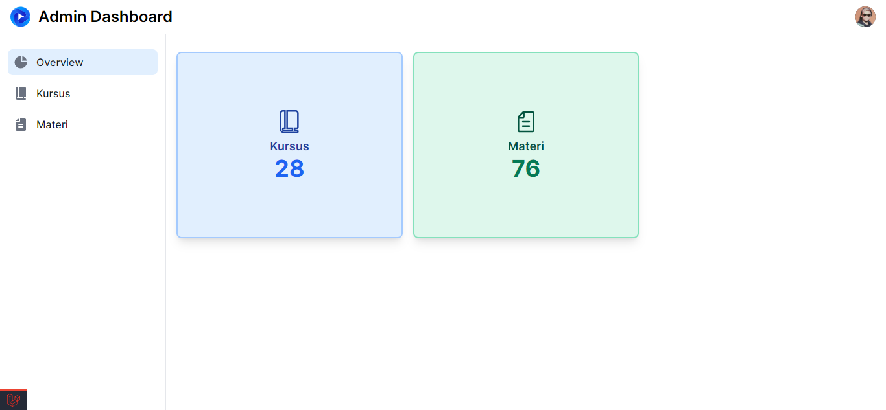

### Halaman Kursus
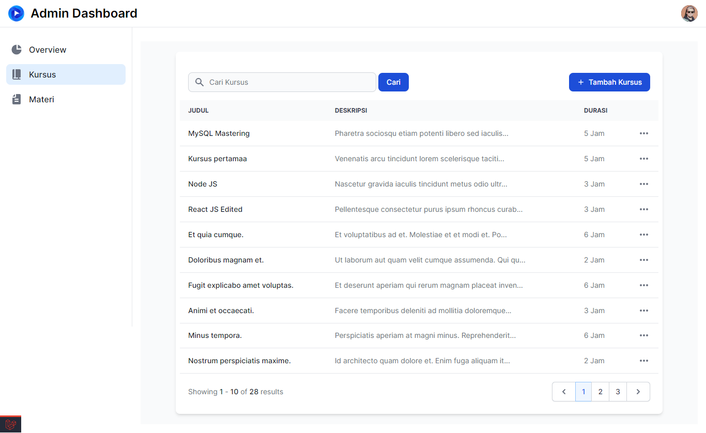

### Halaman Tambah Kursus
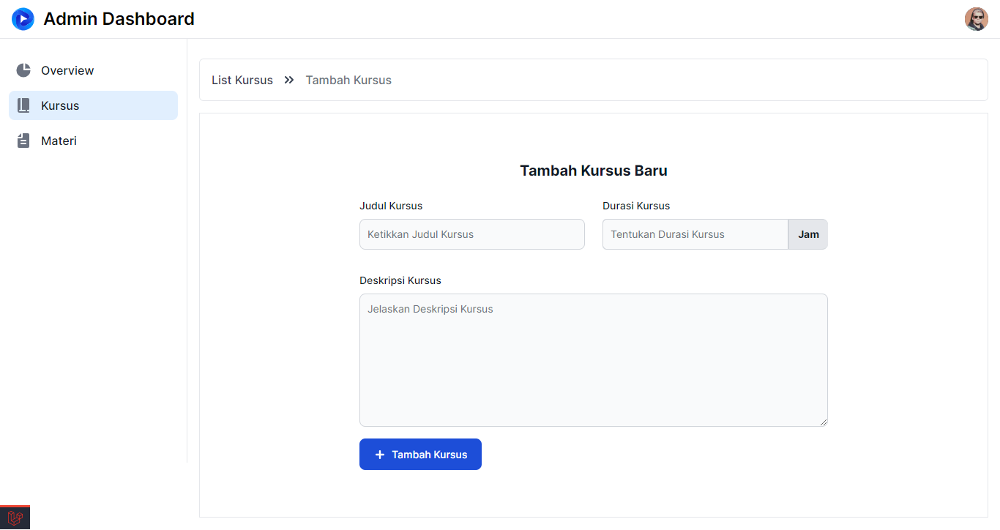

### Halaman Edit Kursus
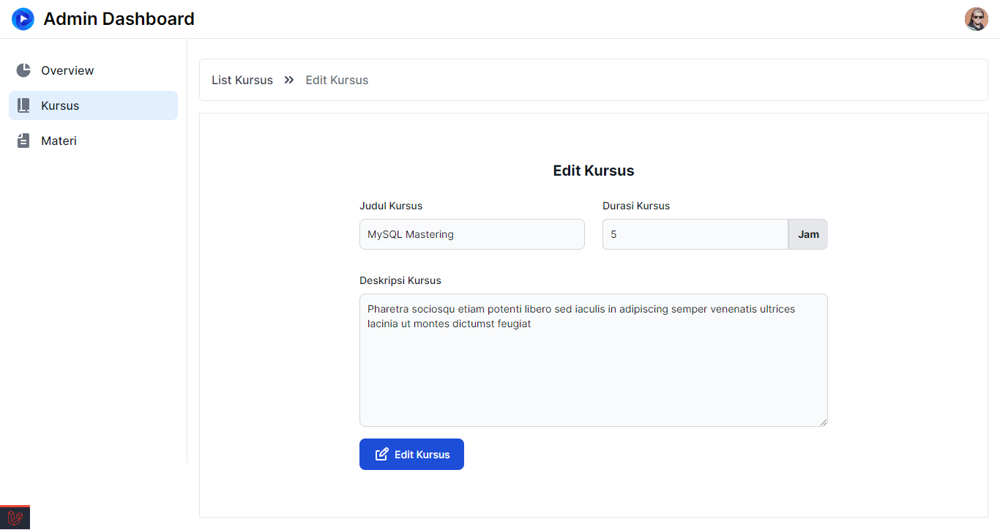

### Halaman Detail Kursus
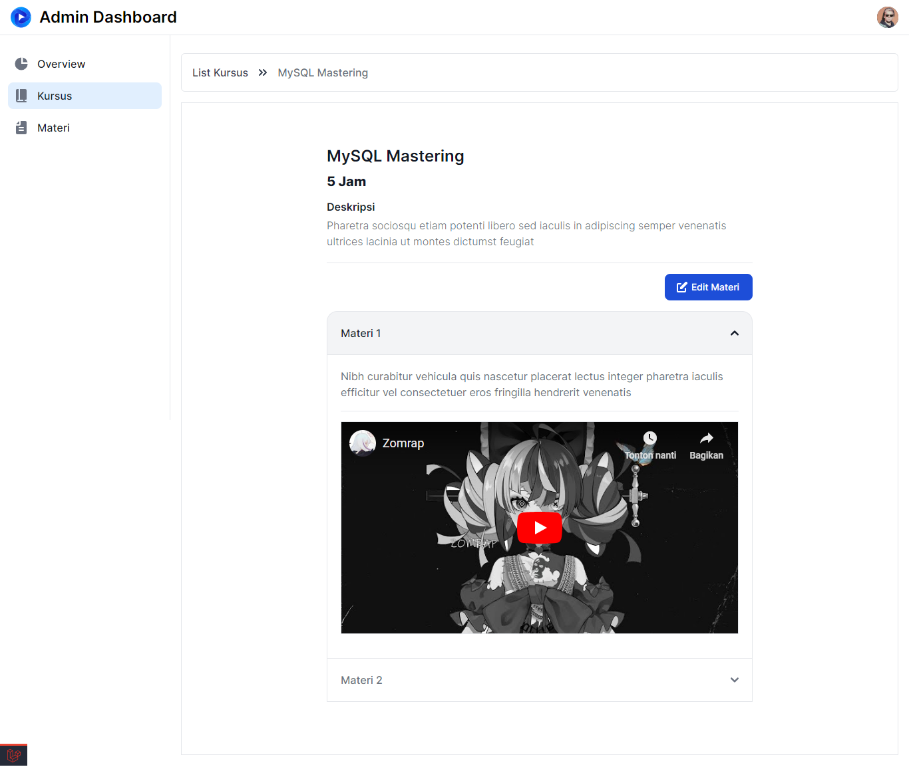

### Halaman Materi
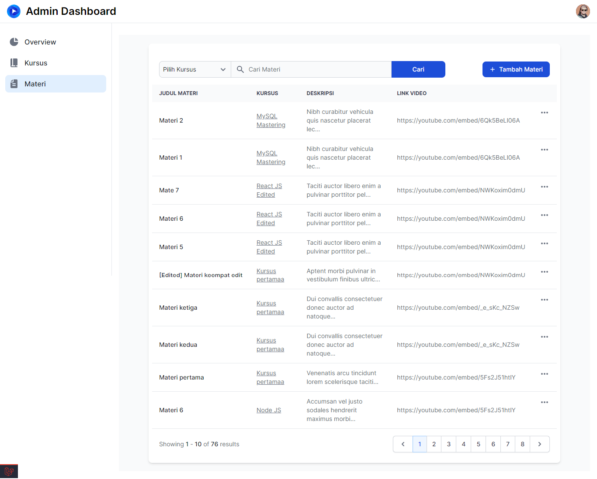

### Halaman Tambah Materi
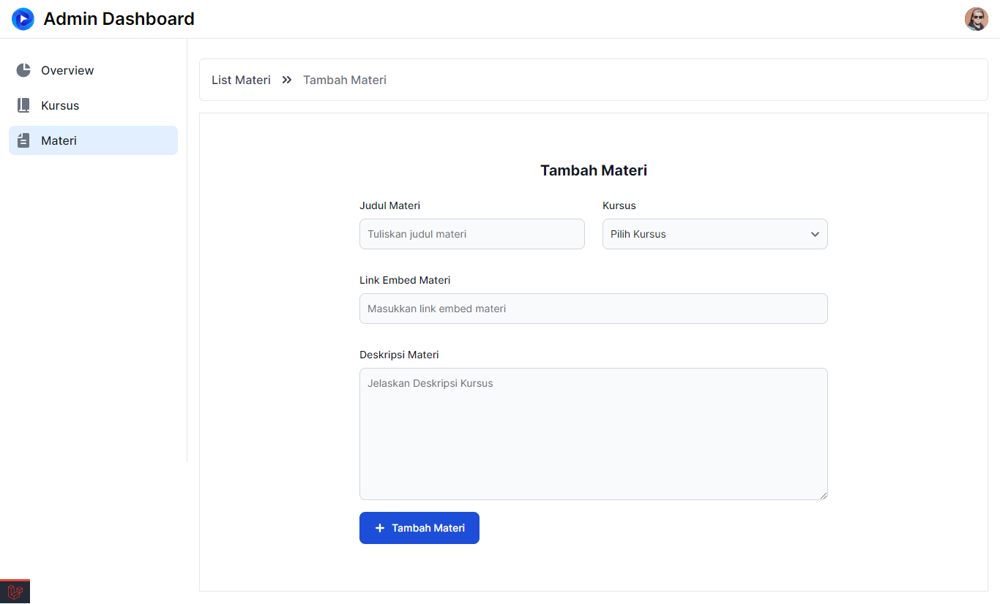

### Halaman Tambah Materi dengan Kursus
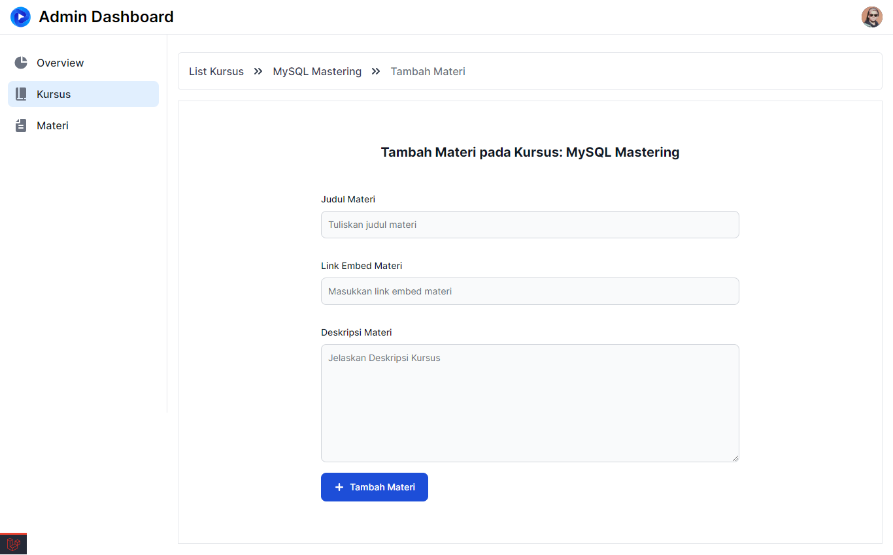

### Pop Up Pesan Berhasil
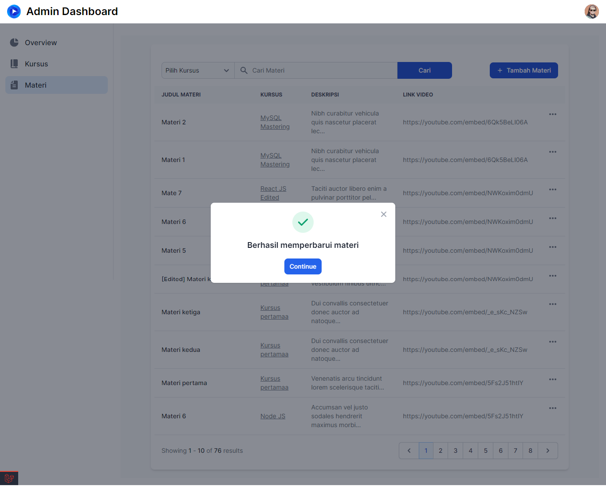

### Pop Up Pesan Gagal
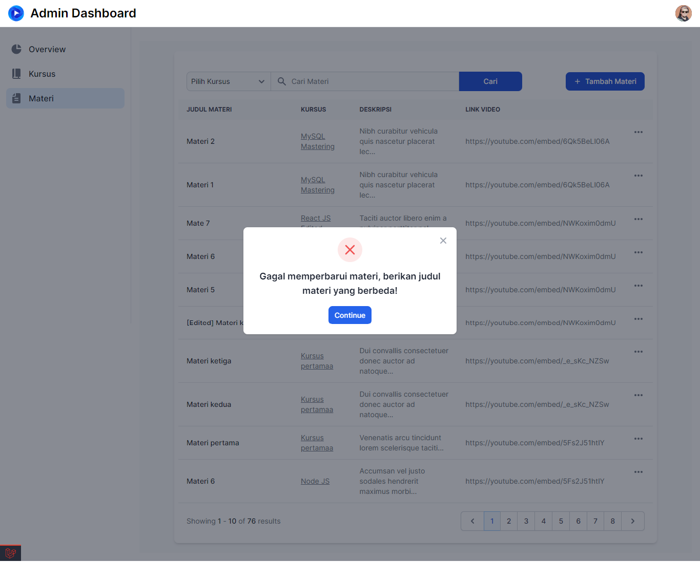

### Pop Up Konfirmasi
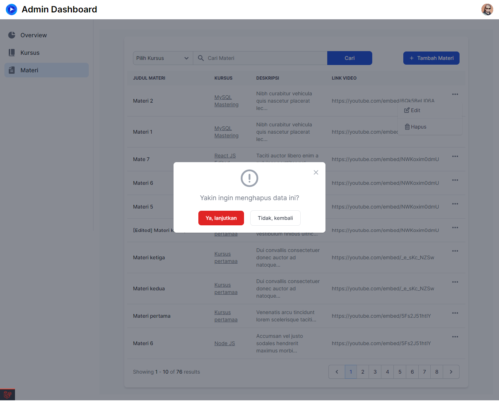
